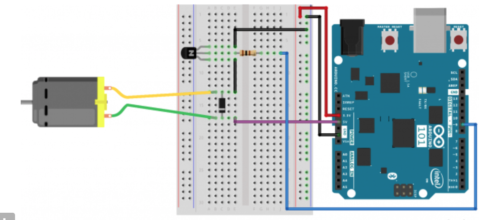

## Controlling motor with Infrared remote control
In this tutorial, we will control a motor with an IR remote control.

## Circuit diagram

## Circuit construction (connections) Infrared
- Transistor collector to diode (black side).
- Gray pin of diode to +5v.
- `+ve` pin of motor to gray pin of diode
- `-ve` pin of motor to transistor base. 
- Transistor base to Arduino pin 3 (PWM) through 220ohm resistor.
- Transistor emitter to ground.

- Signal pin `S` of the IR receiver to Arduino pin 11.
- Ground pin `-` of the IR receiver to ground on the breadboard.
- VCC pin of the IR receiver to +5V.
- Red LED to Arduino pin 13 through a 220 ohm resistor. The longer leg of the LED is the `+` terminal, and the shorter one is the `-` terminal.