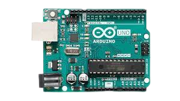
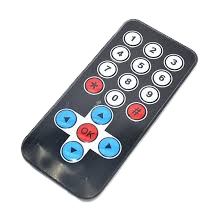
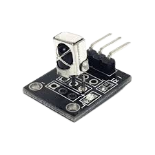
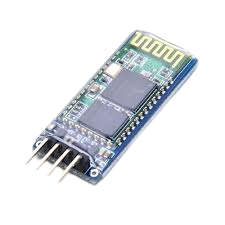
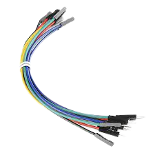
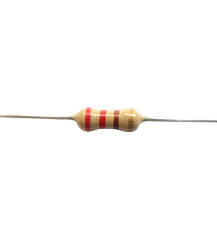

## Home automation
Home automation or domotics involves automatic control of home appliances by electronic systems. These automations are the basis of smart homes. Popular home
automation systems comprise Amazon Alexa, Google Home, etc. In this project, we leverage an Arduino MC to build a home automation system that can
switch on and off lights, fans, etc via infra-red remote control and bluetooth, e.g using a mobile phone.

## Project description
In this project, we use Infrared and Bluetooth technologies to control LED lights. Remote control devices like an infrared remote or mobile phone will be used to send signals to an infrared or bluetooth sensor respectively.
These signals will be interpreted by the Arduino MC and used to turn the lights on or off.

## Identification of components
### Arduino Uno (x1)

- The Arduino Uno is a programmable circuit board, or `microcontroller`. The Arduino Uno will be the `brain` of our electronic projects. It will receive input data from sensors, process this data, and send signals to control a actuators like LEDs (lights), buzzer alarms (sound), or motors (mechanical).

### IR remote control (x1)

- Infrared (IR) communication is one of the most common methods of wireless communication, eg in a TV. When you press a button on an IR remote control, an infrared signal is sent by the remote control to an IR receiver on your TV. Your TV decodes the signal and performs a specific operation. 
### IR receiver (x1)

- The IR receiver is used to receive IR singals from the IR remote. It sends this signal to an Arduino which will decode the signal and perform some operations.

### Bluetooth module (HC-05) (x1)

- The bluetooth module is used by the Arduino MC to communicate with other devices via bluetooth. This module has 4 pins: 1- `VCC`: used to power the bluetooth module, 2- `GND`: the ground pin, 3- `TXD`: transmitter pin of bluetooth module, and 4- `RXD`: receiver pin of bluetooth module. 

### Jumper wires.

- Jumper wires are used to connect sensors and actuators with the Arduino MC.

### Red LED (x1)

- A light emitting diode (LED) is a device that emits light when current flows through it. Diodes like LEDs allow current flow only in one direction. The longer pin on an LED is `+` (anode) and the shorter pin is `-` (cathode).
- LEDs are widely used in Arduino projects.

### 220 ohm resistor.

- Resistors are electrical components that reduce the current flow in a circuit. Resistors are usually used with fragile devices like LEDs which could burn if too much current flows through them.
- Resistors usually have colours which are used to compute the actual resistance in a circuit. The picture shows a `220 ohm` resistor.
- Use the Arduino manual (page 32) to identify a `220 ohm` resistor. Resistors will be connected to all LEDs. This prevents the LEDs from being destroyed by high current.

## IDE setup
- Download and install the `IRremote` library: `Tools --> Manage libraries --> search for IRremote (by Armin Joachimsmeyer) --> Install`

## Circuit construction (connections) - Part I: Infrared
- Signal pin `S` of the IR receiver to Arduino pin 11.
- Ground pin `-` of the IR receiver to ground on the breadboard.
- VCC pin of the IR receiver to +5V.
- Red LED to Arduino pin 13 through a 220 ohm resistor. The longer leg of the LED is the `+` terminal, and the shorter one is the `-` terminal.

#### Arduino program: Infrared
- After building the circuit, open the Arduino program.
- Explain the code to the students and answer any questions.
- In the Arduino program's `loop` function, uncomment the `runInfrared` function.
- Compile the program and make sure there are no compilation errors. A successful compilation prints `Done compiling` in the IDE terminal.
- Connect the Arduino Uno to a laptop USB port using the USB cable.
- Upload the program to the Arduino Uno. Make sure the upload is successful. A successful upload prints the message `Done uploading` in the IDE terminal.
- Each time a button on the IR remote control is pressed, it sends a signal to the IR receiver which in turn sends the code to the Arduino Uno microcontroller. We can observe the hexadecimal code corresponding to a button on the remote control using the `Serial Monitor` of the Arduino IDE. 
- Open the `serial monitor`: `Tools --> Serial Monitor`. 
- Point the remote control towards the IR receiver and press a button: observe that each time a button is pressed, a HEX code is written in the serial monitor. 
- We will use `button 1` to turn on the red LED, and `button 3` to turn if off. So press `1` on the remote control and note its HEX code; do the same for `3` and note its HEX code. Ignore any codes with `FFFFFF`.
- Modify the Arduino code which turns on and off the red LED to test for the codes you noted above. For example, if the code for `button 1` is: `FF6897`, change the code from `if(results.value == 000)` to `if(results.value == 0xFF6897)`.
- Recompile your program and upload to the Arduino again.
- Now when you press `button 1`, the red LED is turned on, and when you press `button 3`, the red LED is turned off.

## Circuit diagram: Bluetooth
### Circuit construction (connections) - Part II: Bluetooth
- VCC pin of bluetooth module to +5V.
- Ground pin of bluetooth module to Arduino ground.
- TXD pin of bluetooth module to Arduino RX pin (Pin 0): the bluetooth module's transmitter pin transmits data serially to the receiver pin of the Arduino.
- RXD pin of bluetooth module to Arduino TX pin (Pin 1): the Arduino transmission pin sends messages to the receiver pin of the bluetooth module.
- Connect the red LED to Arduino pin 13 through a 221 ohm resistor.

#### Arduino program: Bluetooth
- After building the circuit, open the Arduino program.
- Explain the code to the students and answer any questions.
- In the `loop` function of the Arduino program, uncomment the `runBluetooth` function. 
- Compile the program and ake sure there are no compilation errors. A successful compilation prints `Done compiling` in the IDE terminal.
- Connect the Arduino Uno to a laptop USB port using the USB cable.
- Before uploading the program to the Arduino Uno, disconnect the TX and RX pins from the Arduino. This will prevent interference during transmission of the code to the board.
- Upload the program to the Arduino Uno. Make sure the upload is successful. A successful upload prints the message `Done uploading` in the IDE terminal.
- After uploading the program to the Arduino Uno, connect the TX and RX pins of the bluetooth module again to the Arduino.
- Open the bluetooth application and scan for the HC-05 bluetooth module. Pair your mobile phone with the device. The default code is either `1234` or `0000`.
- Send a `1;` message from the bluetooth application to turn on the LED. 
- Send a `0;` message from the bluetooth application to turn off the LED. 
