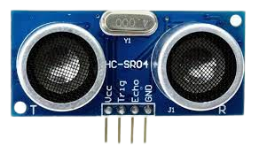
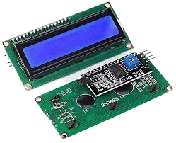
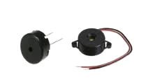

## Proximity sensor
Proximity sensors are used to detect nearby objects without coming into physical contact. Detection of target objects is usually based on sound, IR, electromagnetic fields, etc. Proximity sensors are used in surveillance, automatic doors, radar systems, object
detection (e.g in car parking), speed detection, etc. In this project we design and build a prototype system to mimic object detection in car
parking systems. An ultrasonic sensor is used to detect how close an object (e.g your hand) or a book) is to the sensor. 

## Project description
In this project, you will use an ultrasonic sensor to determine the distance of an object (e.g your hand) from the the module. An LCD monitor will be used to display the distance calculated by the Arduino MC. A buzzer alarm will be set if your hand comes too close, and a warning LED will flash.

## Identification of components
### Arduino Uno (x1)

- The Arduino Uno is a programmable circuit board, or `microcontroller`. The Arduino Uno will be the `brain` of our electronic projects. It will receive input data from sensors, process this data, and send signals to control a actuators like LEDs (lights), buzzer alarms (sound), or motors (mechanical).
### Ultrasonic sensor (HC-SRO4 module) (x1) 

- The ultrasonic sensor can measure distance. It emits an ultrasound at 40kHz which travels through air and if an object or obstacle is in its path, the signal will bounce back to the module. The time and speed of sound is used to calculate the distance.
- The HC-SR04 module has 4 pins: 1- `VCC`: the power pin used to power the module, 2- `Trig`: the trigger pin which generates the ultrasound, 3- `Echo`: the echo pin which receives the echo from the obstacle, and 4- `Gnd`: the ground pin.

### LCD with I2C interface

- The LCD (liquid crystal display) is a module which you can use to print information from the Arduino MC. The I2C (Inter-IC) module enables easy communication between the LCD module and the Arduino MC.
- The I2C module has 4 pins: 1- `SDA`: serial data pin over which data is sent, 2- `SCL`: serial clock pin used to synchronize the transfer of data between the Arduino MC and the LCD-I2C, 3- `GND`: ground pin, and 4- `VCC`: the power pin used to power the LCD module.

### Buzzer alarm

- The buzzer alarm is a device that emits a buzzer sound when it receives a HIGH signal from the Arduino MC.

### Jumper wires

- Jumper wires are used to connect sensors and actuators with the Arduino MC.
- For this project, we will need 6 male-female (M-F) and 6 male-male (M-M) jumper wires.
## IDE setup
- Download and install the `hd44780` library: `Tools --> Manage libraries --> search for hd44780 (choose hd44780 by Bill Perry) --> Install`

## Circuit construction (connections)

- VCC pin of HC-SR04 to +5V on Arduino.
- Trig pin of HC-SR04 to digital pin 3 of Arduino.
- Echo pin of HC-SR04 to digital pin 2 of Arduino.
- Ground pin of HC-SR04 to ground.
- SDA pin of LCD-I2C to analog pin 4 (A4) of Arduino.
- SCL pin of LCD-I2C to analog pin 5 (A5) of Arduino.
- One buzzer pin to pin 7 of Arduino; the other pin on ground of Arduino.

## Arduino program
- After building the circuit, open the Arduino program.
- Explain the code to the students and answer any questions.
- Compile the program and make sure there are no compilation errors. A successful compilation prints `Done compiling` in the IDE terminal.
- Connect the Arduino Uno to a laptop USB port using the USB cable.
- Upload the program to the Arduino Uno. Make sure the upload is successful. A successful upload prints the message `Done uploading` in the IDE terminal.

- Move the object/obstacle closer to and further from the ultrasonic sensor.
- You can observe on the calculated distance from the obstacle changes.
- If the obstacle is within 10cm from the ultrasonic module, the buzzer alarm is turned on; otherwise it goes off.
- Ask the students how they can apply this in real life. Write down the ideas and share them during presentations.

- You can observe on the LCD screen the atmospheric humidity and temperature. 
- Modify the temperature threshold in the program for the buzzer alarm.
- Modify the buzzer frequency and observe.
- Ask the students how they can apply this in real life. Write down the ideas and share them during presentations.