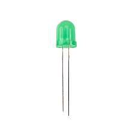

## Gas leak and smoke detection system
Accidental gas leaks or fires pose very large threats to property, the environment and human life. Many industrial facilities as well as homes, comprise technological setups to detect gas leaks and fires, and transmit useful notifications like alarms, automatic SMS/calls, etc. This project aims to build a simple prototype gas leak/smoke detection system based on the Arduino MC. Gas, smoke, and temperature sensors are used to detect any accidental gas leaks or fire, and trigger necessary alarms e.g SMS calls, LED flashes, or buzzers.

## Project description
In this project, you will use a gas sensor to determine if there is a gas leak. The sensor will send a signal to the Arduino MC when it detects a high gas/smoke concentration. The Arduino will respond by turning on a buzzer alarm and flashing a red LED. When the gas concentration returns to normal, the green LED will turn on.

## Identification of components
### Arduino Uno (x1)

- The Arduino Uno is a programmable circuit board, or `microcontroller`. The Arduino Uno will be the `brain` of our electronic projects. It will receive input data from sensors, process this data, and send signals to control a actuators like LEDs (lights), buzzer alarms (sound), or motors (mechanical).

### MQ2 gas sensor (x1)

- The MQ2 gas sensor is an electronic sensor used for sensing the concentration of gases in the air such as propane, methane, hydrogen, smoke, alcohol, carbon monoxide etc. This sensor detects gas concentrations in the between 300ppm to 10000ppm. `ppm` is `parts-per-million` and is a unit of measure for gas concentration. 
- The gas sensor sends an analog or digital value to the Arduino which represents the gas concentration.
- The MQ2 gas sensor has 4 pins: 1- `VCC`: this pin powers the module, 2- `GND`: the ground pin, 3- `A0`: used to send an analog signal when gas is detected, and 4- `D0`: used to send a digital signal when gas is detected.

### Buzzer alarm

- The buzzer alarm is a device that emits a buzzer sound when it receives a HIGH signal from the Arduino MC.

### Jumper wires

- Jumper wires are used to connect sensors and actuators with the Arduino MC.
- For this project, we will need 6 male-female (M-F) and 6 male-male (M-M) jumper wires.

### Red LED

- A light emitting diode (LED) is a device that emits light when current flows through it. Diodes like LEDs allow current flow only in one direction. The longer pin on an LED is `+` (anode) and the shorter pin is `-` (cathode).
- LEDs are widely used in Arduino projects.
- In this project, a red LED will flash when gas concentration is high.

### Green LED

- In this project, a green LED will be stay on when the gas concentration is low.

### Resistor (220 ohm)

- Resistors are electrical components that reduce the current flow in a circuit. Resistors are usually used with fragile devices like LEDs which could burn if too much current flows through them.
- Resistors usually have colours which are used to compute the actual resistance in a circuit. The picture shows a `220 ohm` resistor.

## Circuit construction (connections)

- VCC pin of gas sensor to +5V on Arduino.
- Ground pin of gas sensor to Arduino ground.
- A0 pin of gas sensor to analog pin A0 of Arduino. We will not use the D0 pin in this exercise.
- Red LED `+` pin to pin 13 of Arduino through 220 ohm resistor; `-` pin to ground.
- Green LED `+` pin to pin 12 of Arduino through 220 ohm resistor; `-` pin to ground.
- One buzzer pin to pin 7 of Arduino; the other pin on ground of Arduino.

## Arduino program
- After building the circuit, open the Arduino program.
- Explain the code to the students and answer any questions.
- Compile the program and make sure there are no compilation errors. A successful compilation prints `Done compiling` in the IDE terminal.
- Connect the Arduino Uno to a laptop USB port using the USB cable.
- Upload the program to the Arduino Uno. Make sure the upload is successful. A successful upload prints the message `Done uploading` in the IDE terminal.
- At the onset, the gas/smoke concentration is not high so the green LED is on, while the red LED stays off.

- To increase the smoke concentration, use a lighter to burn a small piece of paper. Turn off the flames and place the smoke close to the gas sensor.
- You observe that the buzzer alarm starts, and the red LED flashes. This is because the gas concentration has crossed the threshold set in the program.
- As the smoke and gas disappear, you observe that the gas concentration gets low again and the green LED turns on, while the buzzer and red LED go off.
- Repeat the exercise multiple times with the students.
- Ask the students how they can apply this in real life. Write down the ideas and share them during presentations.
