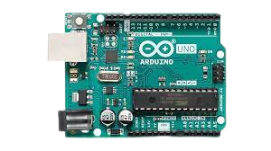
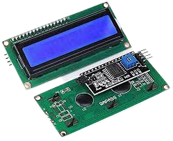
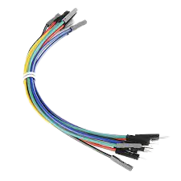

## Weather station
A weather station consists of instruments and equipment (e.g temperature and humidity sensors) for monitoring atmospheric conditions. Weather stations provide information used for weather forecasts as well as scientific research. In this project we design and build a prototype weather station capable of monitoring
atmospheric temperature, humidity, etc. Sensors are used to obtain data which is sent to an Arduino microcontroller for processing. The results from the Arduino are then displayed on an LCD display. Additional functionality like a buzzer alarm system could be added to provide notifications when the temperature rises above a certain level.

## Project description
In this project, you will use a temperature and humidity sensor to determine atmospheric temperature and humidity. The sensors will send signals to the Arduino MC, which will process these signals and display the results on an LCD monitor. A buzzer alarm system will be used to detect when atmospheric temperature rises above a certain threshold.
## Identification of components
### Arduino Uno (x1)

- The Arduino Uno is a programmable circuit board, or `microcontroller`. The Arduino Uno will be the `brain` of our electronic projects. It will receive input data from sensors, process this data, and send signals to control a actuators like LEDs (lights), buzzer alarms (sound), or motors (mechanical).

### Temperature and Humidity sensor (DHT11 module) (x1)

- The DHT11 module measures humidity and temperature, and transmits the information to the Arduino MC.
### LCD with I2C interface

- The LCD (liquid crystal display) is a module which you can use to print information from the Arduino MC. The I2C (Inter-IC) module enables easy communication between the LCD module and the Arduino MC.
- The I2C module has 4 pins: 1- `SDA`: serial data pin over which data is sent, 2- `SCL`: serial clock pin used to synchronize the transfer of data between the Arduino MC and the LCD-I2C, 3- `GND`: ground pin, and 4- `VCC`: the power pin used to power the LCD module.

### Buzzer alarm

- The buzzer alarm is a device that emits a buzzer sound when it receives a HIGH signal from the Arduino MC.
### 10 Kohm resistor

- Resistors are electrical components that reduce the current flow in a circuit. Resistors are usually used with fragile devices like LEDs which could burn if too much current flows through them.
- Resistors usually have colours which are used to compute the actual resistance in a circuit. The picture shows a `10 kohm (10000 ohm)` resistor.
- This resistor will be used as a pull-up resistor for the signal pin from the DHT11 module. Pull up resistors ensure that the signal pin reads high if there is not signal.

### Jumper wires

- Jumper wires are used to connect sensors and actuators with the Arduino MC.
- For this project, we will need 4 male-female (M-F) jumper wires.

## IDE setup
- Download and install the `DHT Sensor` library: `Tools --> Manage libraries --> search for dht (choose DHT sensor library by Adafruit) --> Install`
- Download and install the `hd44780` library: `Tools --> Manage libraries --> search for hd44780 (choose hd44780 by Bill Perry) --> Install`

<!-- - Add the LCD-I2C library: `Sketch -- Include Library -- Add. Zip library -- choose -->

## Circuit construction (connections)
- With the DHT module facing you, the pins from left to right are as follows: `VCC (+)`, `Signal pin`, `Not used`, and `Ground (-)`.
- VCC pin of the DHT11 module to +5V on Arduino.
- Signal pin of the DHT11 module to pin 11 of the Arduino Uno through the 10 KOhm resistor.
- Ground pin of DHT11 module to ground on Arduino.
- SDA pin of LCD-I2C to analog pin 4 (A4) of Arduino.
- SCL pin of LCD-I2C to analog pin 5 (A5) of Arduino.
- One buzzer pin to pin 7 of Arduino; the other pin on ground of Arduino.

## Arduino program
- After building the circuit, open the Arduino program.
- Explain the code to the students and answer any questions.
- Compile the program and make sure there are no compilation errors. A successful compilation prints `Done compiling` in the IDE terminal.
- Connect the Arduino Uno to a laptop USB port using the USB cable.
- Upload the program to the Arduino Uno. Make sure the upload is successful. A successful upload prints the message `Done uploading` in the IDE terminal.
- You can observe on the LCD screen the atmospheric humidity and temperature. 
- Modify the temperature threshold in the program for the buzzer alarm.
- Modify the buzzer frequency and observe.
- Ask the students how they can apply this in real life. Write down the ideas and share them during presentations.