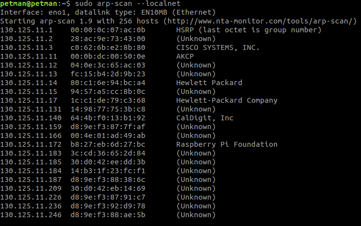

## Setting up Raspberry Pi on Ubuntu 18 (no peripherals needed)

### Download and flash Raspberry Pi OS image
- Download `balenaEtcher` tool for ubuntu: [balenaEtcher](https://www.balena.io/etcher/)
- Download a compatible Raspberry Pi OS image for your board: [Raspberry Pi OS Downloads](https://www.raspberrypi.com/software/operating-systems/). The `Lite` versions do not come with an embedded GUI and have less software included. I use the Lite version for my work.
- Connect a microSD card to your PC and use `balenaEtcher` to flash the downloaded OS image to the card. This is pretty straight forward, no need for a long tutorial.
- Leave the microSD card connected to your PC for now.

### Enable SSH
- SSH access will be required for you to access your Pi remotely. Get into the boot folder of the microSD card and create a file named `ssh`.
```
touch ssh
``` 


### Enable Wifi
- TODO

### Setup your pi board
- Remove the microSD card from your PC, insert it into your Pi board and power up the board.
- 


### Getting your Pi IP address.

#### Using arp-scan
- This IMO is the quickest solution to obtain your Pi's IP address but you could use `nmap` too. See next section.
- Install and run `arp-scan`
```
sudo apt install arp-scan
sudo arp-scan --localnet

```
- A sample result of the scan:

- The Pi IP here is `130.125.11.172`.


#### Using nmap
- Install `nmap` and `net-tools`.
```
sudo apt install nmap net-tools
```
- Run `ifconfig | grep netmask` in the terminal to obtain your subnet mask IP. 
- Example `ifconfig` results: the output ` inet 130.125.11.148  netmask 255.255.255.0` means the subnet mask IP is `130.125.11.0` and subnet mask `/24`. That is the first 24 bits (8x3) are masked.
- For `netmask 255.255.0.0`, the subnet mask will be `/16`.
- Run `nmap` with your subnet mask to scan your subnet and obtain your Pi's IP address.
```
nmap -sP 130.125.11.0/24

```
- Locate your Pi in the list (mine found the Pi but the name was absent)

### SSH into your Pi
- Run the command `ssh pi@pi-IP-address`. For example:
```
ssh pi@130.125.11.172
```
- `Are you sure you want to continue connecting (yes/no)?`: enter `yes`.
- `pi@130.125.11.172's password:`: the default Pi password is `raspberry`.
- You should now have a remote connection to your Pi.


### Update your source lists and install some useful packages
- In the ssh terminal of your Pi, enter the following commands:

```
sudo apt update && sudo apt install git -y 
```

### Remote development on your Pi with vscode
- I'm a fan of `vscode` and use it as my main `IDE`. You can configure `vscode` to access folders and files remotely on your Pi. Doing this you can easily write scripts and test on your Pi board remotely.
- See this tutorial for setting up [remote development using SSH in vscode](https://code.visualstudio.com/docs/remote/ssh).
- For development on your Raspberry Pi, the [official documentation]() is a gold mine. Have fun 


### Author
- Peterson Yuhala
- Send me an email: `petersonyuhala@gmail.com` if you've got questions.